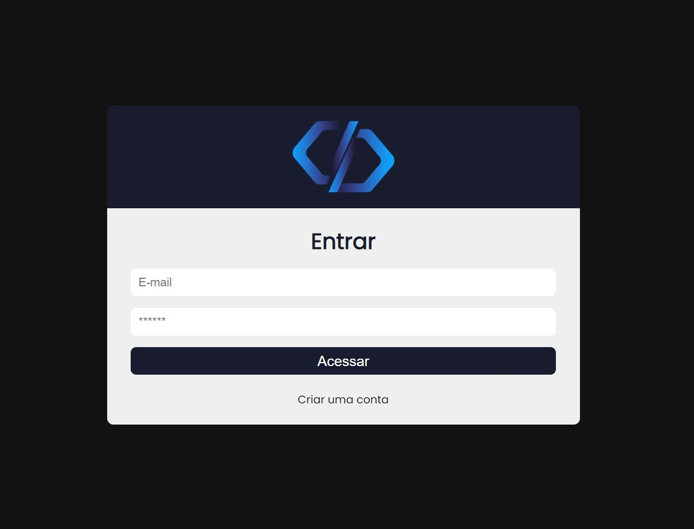
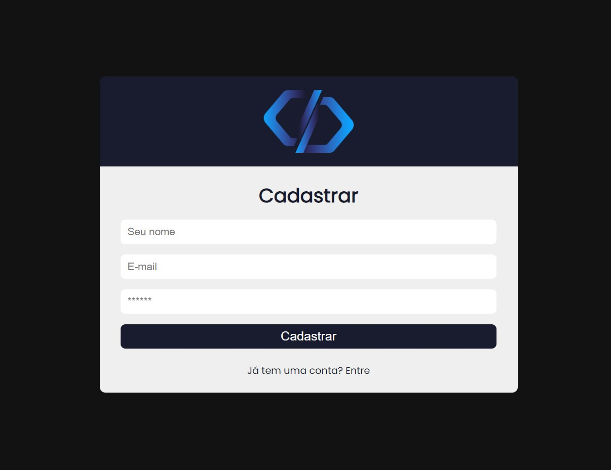
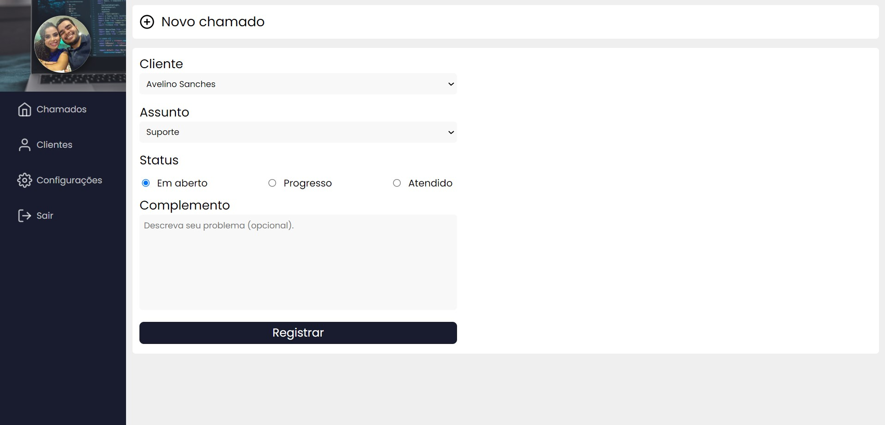
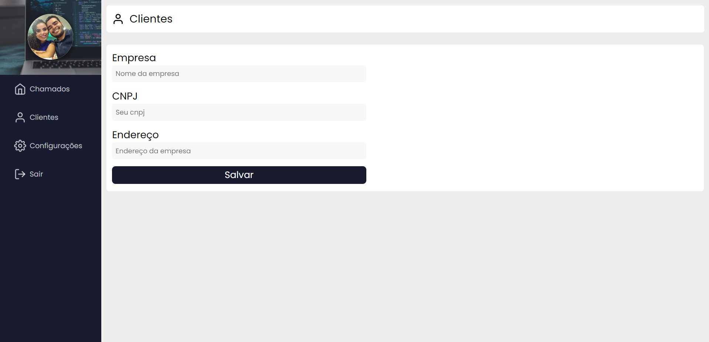
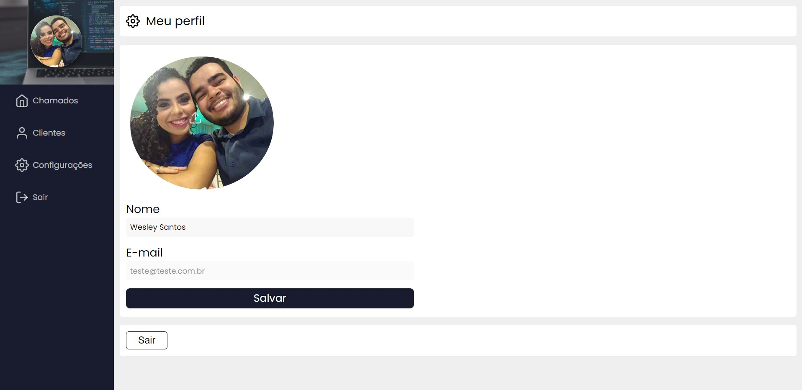

# Sistema de Chamados

Sistema desenvolvido durante o curso de React.

https://novosistemachamados.netlify.app/

## Como usar

  
<strong>Como usar a aplicação</strong>

  <ul>
    <li>Acesse o site: https://novosistemachamados.netlify.app/</li>
    <li>Vá na página de cadastro e crie o seu com nome, e-mail e senha.</li>
    <li>Entre na seção de Clientes e crie um novo cliente.</li>
    <li>Na página "Chamados", selecione o botão "Novo Chamado" e crie um chamado de exemplo para esse novo cliente.</li>
  </ul>

## Páginas

### Entrar

A página de login é integrada com o Firebase Auth e o uso da plataforma é liberado por e-mail e senha.

   
  Imagem 01: página "Entrar".

### Cadastro

Nesta página, para liberar o acesso basta inserir o seu nome, e-mail da sua preferência e senha que você deseja usar toda vez que for acessar a aplicação.

   
  Imagem 02: página "Cadastro".

### Novo Chamado

Aqui você deve terá os seguintes campos para realizar o cadastro do novo chamado:
- Cliente (que você deverá cadastrar na página "Clientes")
- Assunto (Suporte, Visita Técnica ou Financeiro)
- Status (Em Aberto, Progresso ou Atendido)
- Complemento (alguma observação relevante referente ao chamado)

   
  Imagem 03: página "Novo Chamado".

### Clientes

Crie aqui o cadastro dos seus novos clientes inserindo as informações nos campos Empresa, CNPJ e Endereço.

   
  Imagem 04: página "Clientes".

### Configurações

Nas Configurações, coloque a imagem que você desejar para se identificar e o seu nome (ou nome que você gosta de ser chamado).

   
  Imagem 05: página "Configurações".

## Tecnologias utilizadas

- [x] React
- [x] Jsx
- [x] Javascript
- [x] Styled Components
- [x] Context-API
- [x] Firebase (Auth, Firestore e Storage)

## Desenvolvimento

<table>
  <tr>
    <td border="1px solid #ddd" align="center">
      <a href="https://github.com/wesleysantossts">
        
         
        Wesley Santos
      </a>
    </td>
  </tr>
</table>
